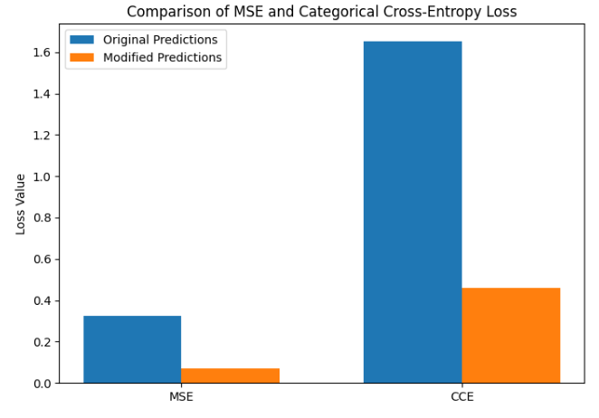
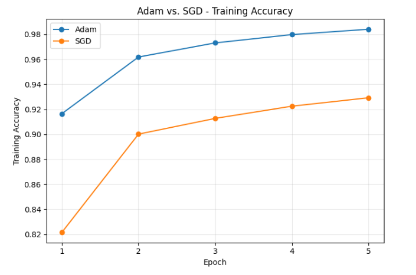
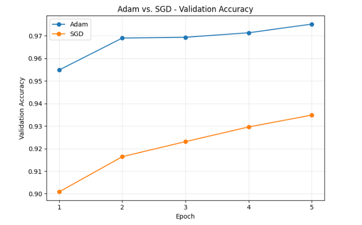
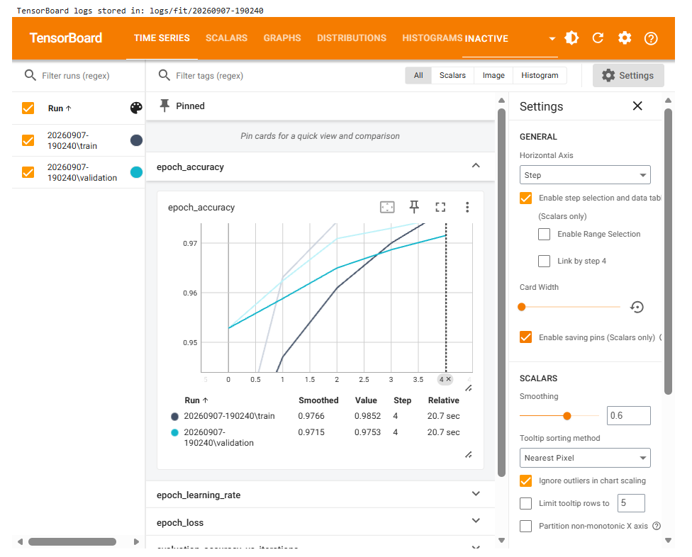
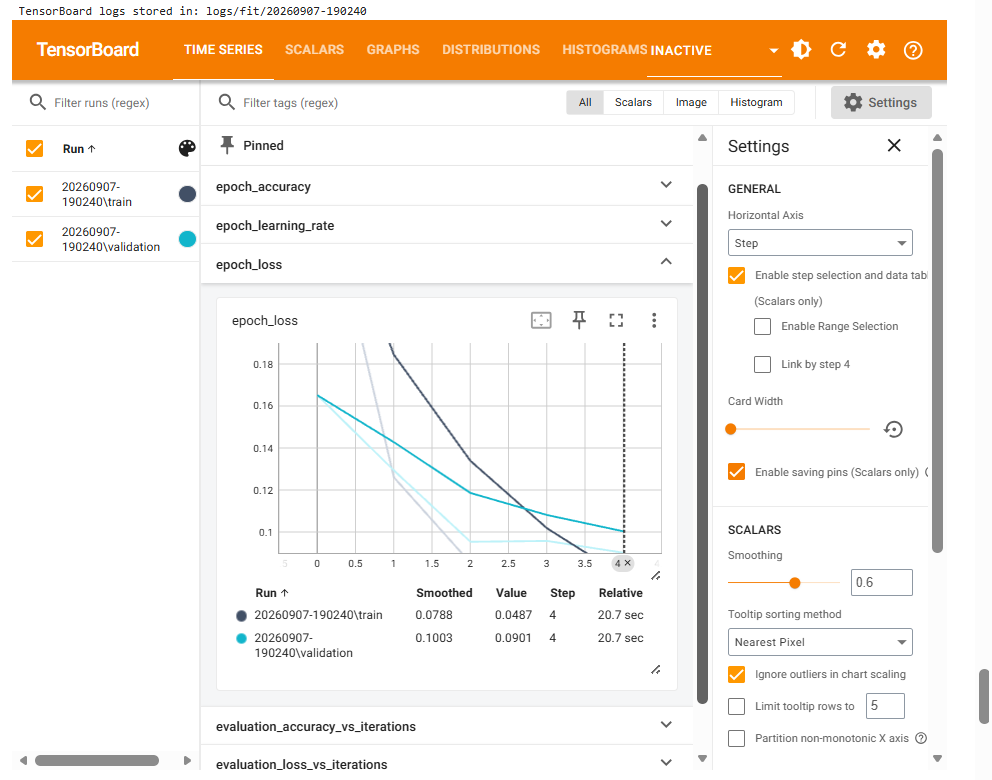

# Neural Network Fundamentals with TensorFlow

A practical TensorFlow notebook exploring core neural-network concepts through tensor operations, loss functions, optimizer comparison, MNIST classification, and TensorBoard monitoring.

The work progresses from manipulating tensors to training and evaluating neural networks, with each section designed to show not only **how** an operation is implemented, but also **why** it is useful.

## What This Project Covers

### 1. Tensor Manipulation and Reshaping

The first section introduces TensorFlow tensors and common operations used to prepare multidimensional data for computation.

It demonstrates how to:

- create a random tensor with shape `(4, 6)`;
- inspect tensor rank and shape;
- reshape the tensor to `(2, 3, 4)` without changing its 24 underlying values;
- transpose it to `(3, 2, 4)` by reordering dimensions; and
- broadcast a smaller `(1, 4)` tensor to `(3, 2, 4)` before performing element-wise addition.

This section also explains broadcasting as a way of working with tensors of compatible but different shapes without manually repeating values or writing loops.

### 2. Loss Functions: MSE and Categorical Cross-Entropy

The second section examines how loss functions measure the difference between expected and predicted values.

Controlled `y_true` and `y_pred` values are defined manually so that changes in the loss can be observed directly. The predictions are then modified and the losses are recalculated.

The experiment produced:

| Prediction Set | MSE | Categorical Cross-Entropy |
| --- | ---: | ---: |
| Original | 0.3267 | 1.6539 |
| Modified | 0.0689 | 0.4594 |

Both losses decreased after the predictions were modified. This shows that the modified predictions were, overall, closer to the true class labels.



### 3. Adam vs. SGD on MNIST

The third section compares two optimizers while keeping the dataset, neural-network architecture, batch size, validation split, and number of epochs the same.

The MNIST images are normalized from the original `0–255` pixel range to `0–1`. Both models use:

- an input shape of `28 × 28`;
- a `Flatten` layer that converts each image into 784 values;
- a hidden `Dense` layer with 128 neurons and ReLU activation;
- a 10-neuron Softmax output layer for digits `0–9`;
- Sparse Categorical Cross-Entropy loss;
- batch size `32`;
- a `20%` validation split; and
- `5` training epochs.

The only intended difference between the two training runs is the optimizer: **Adam** versus **SGD**.

By epoch 5:

| Optimizer | Training Accuracy | Validation Accuracy |
| --- | ---: | ---: |
| Adam | 98.4% | 97.5% |
| SGD | 92.9% | 93.5% |

Under these training conditions, both optimizers improved over time, but Adam converged faster and reached higher training and validation accuracy within five epochs.





### 4. Neural Network Training with TensorBoard

The final section trains a simple MNIST neural network with Adam for five epochs and uses a TensorBoard callback to record training information.

The model was built and trained using TensorFlow's Keras API, while the Keras TensorBoard callback recorded training and validation metrics such as accuracy and loss for visualization in TensorBoard.

A timestamped log directory under `logs/fit/` keeps the training run separate, while TensorBoard provides a visual way to compare training and validation behavior.

The final epoch recorded:

| Metric | Training | Validation |
| --- | ---: | ---: |
| Accuracy | 98.5% | 97.5% |
| Loss | 0.0487 | 0.0901 |

Across the five epochs, training and validation accuracy improved overall while both loss values decreased. The validation metrics remained close to the training performance, with no clear indication of overfitting during the five-epoch run.

Because TensorBoard is served interactively from the local environment, the saved screenshots below preserve the observed curves for repository viewing.

#### Accuracy



#### Loss



## Interpreting the TensorBoard Curves

The training and validation accuracy curves generally rise as the model learns, while the corresponding loss curves fall.

TensorBoard can also help identify overfitting. A warning pattern would be training accuracy continuing to increase while validation accuracy stops improving or declines, especially when training loss continues to fall while validation loss begins to rise.

Increasing the number of epochs gives the network more opportunities to learn. Additional epochs may improve performance initially, but training for too long can eventually cause the model to fit the training data too closely and reduce its ability to generalize to validation data.

## Running the Notebook

The notebook requires Python with:

- TensorFlow
- TensorBoard
- Matplotlib
- Jupyter Notebook

If TensorFlow and TensorBoard are not already installed in your environment, install them before running the notebook.

**From a terminal or command prompt:**

```bash
pip install tensorflow tensorboard
```

**From a Jupyter Notebook cell:**

```python
%pip install tensorflow
%pip install tensorboard
```

After installation, restart the Jupyter kernel if required.

Then open `Neural Networks_HA1.ipynb` in Jupyter Notebook and run the cells from top to bottom.

MNIST is loaded through `tf.keras.datasets.mnist.load_data()`. If the dataset is not already cached locally, TensorFlow will download it the first time the relevant cell is run.

For the TensorBoard section, the notebook creates logs under `logs/fit/` and launches TensorBoard with:

```python
%load_ext tensorboard
%tensorboard --logdir logs/fit
```

The interactive TensorBoard dashboard depends on a running local Jupyter/TensorBoard session. The repository therefore also includes the TensorBoard accuracy and loss screenshots produced from the recorded run.

## Key Takeaways

This work demonstrates several connected ideas used in neural-network development:

- Tensor shape and dimension management are fundamental to preparing data for neural-network operations;
- Broadcasting makes compatible tensor operations possible without manual repetition;
- Loss functions quantify prediction error and respond as predictions move closer to or farther from the true values;
- Optimizer choice can significantly affect how quickly a model learns under otherwise identical training conditions; and
- TensorBoard provides a practical way to monitor training and validation behavior and identify patterns such as possible overfitting.

## Technologies Used

**Python · TensorFlow · Keras · Matplotlib · TensorBoard · Jupyter**
