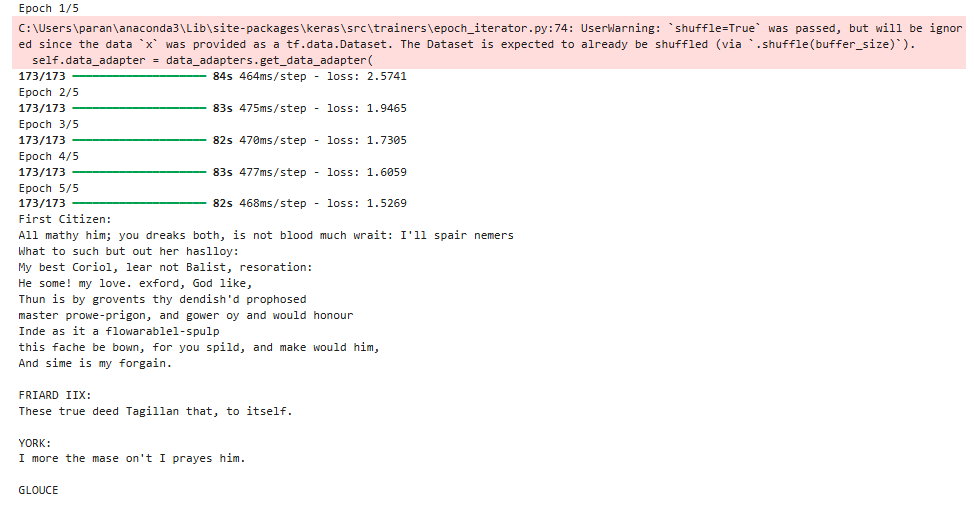
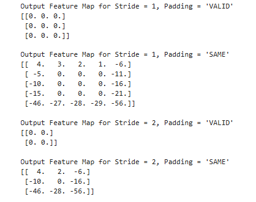
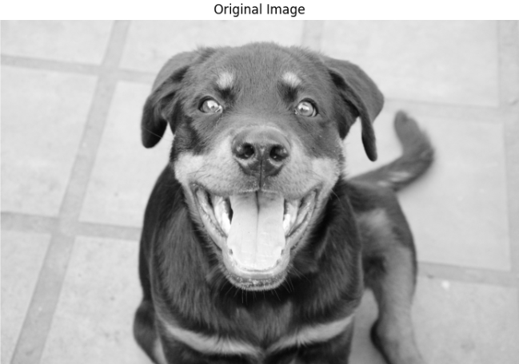
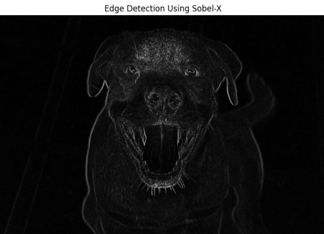
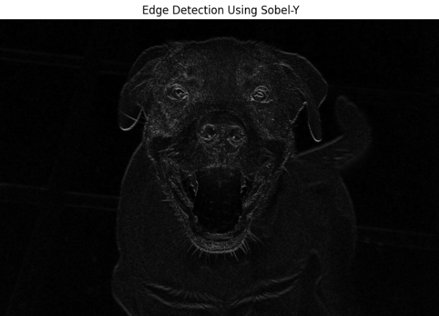
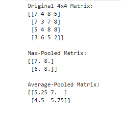
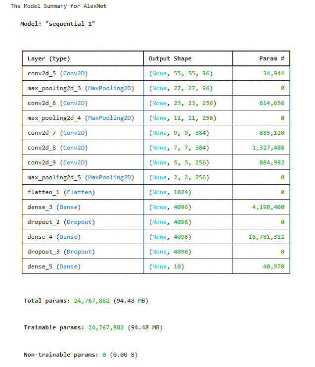
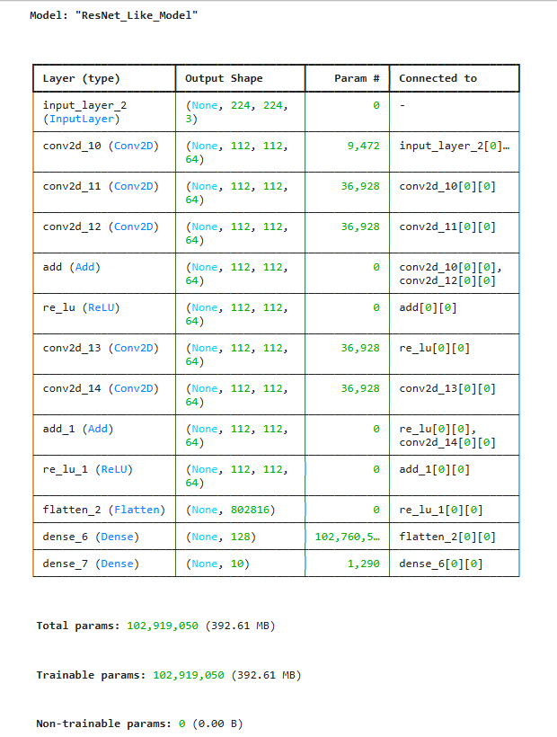

# Neural Networks: RNN, LSTM, and CNN Experiments

This project explores how neural networks can work with both **text and
images**. It moves from Recurrent Neural Networks (RNNs) that learn
patterns in sequences of text to Convolutional Neural Networks (CNNs)
that extract patterns and features from images.

The assignment is divided into five notebooks. Each question focuses on
a different idea and shows not only **how it is implemented**, but also
**what the result means**.

## What This Project Covers

### 1. Character-Level Text Generation with LSTM

The first question explores whether a neural network can learn patterns
in text and use those patterns to generate new text.

The Shakespeare dataset used in this experiment contained **1,115,394
characters** and **65 unique characters**. Since a neural network cannot
work directly with letters and punctuation, each character was first
converted into an integer ID.

The model contained:

-   an **Embedding layer** to learn a numerical representation for each
    character;
-   an **LSTM layer with 512 units** to learn patterns across sequences
    of characters; and
-   a **Dense output layer with 65 neurons**, one for each possible
    character.

The complete model contained **1,624,897 trainable parameters**.

During five training epochs, the loss decreased from **2.5741 to
1.5269**:

  Epoch       Loss
  ------- --------
  1         2.5741
  2         1.9465
  3         1.7305
  4         1.6059
  5         1.5269

A decreasing loss means that the model became better at predicting the
next character in the Shakespeare text.

After training, `"First Citizen:"` was used as the starting text. The
model then generated new text **one character at a time**. The generated
text was not always meaningful English, but it showed patterns similar
to the training data, including capitalization, punctuation, line
breaks, word-like structures, and character dialogue.



#### Temperature Scaling

Temperature controls how predictable or random the generated text is.

-   A **lower temperature** makes the model favor characters that it
    already considers very likely. The result is usually more
    predictable.
-   A temperature of **1.0** keeps the original prediction scores
    unchanged.
-   A **higher temperature** gives less likely characters a greater
    chance of being selected. This creates more variety, but the
    generated text may become less coherent.

------------------------------------------------------------------------

### 2. Sentiment Classification with LSTM

The second question uses an LSTM for a different purpose: **sentiment
classification**.

Instead of generating text, the goal is to read a movie review and
decide whether it expresses a **positive or negative sentiment**.

The IMDB dataset contained:

-   **25,000 training reviews**
-   **25,000 testing reviews**

The reviews were already represented as sequences of integer word IDs.
Because reviews can have different lengths, each review was padded or
truncated to **200 tokens** so that the model could process inputs of a
consistent size.

The classifier used:

-   an **Embedding layer** to learn representations of the word IDs;
-   an **LSTM layer with 64 units** to learn patterns in the review; and
-   a **Sigmoid output neuron** that produced a probability used to
    classify the review as negative or positive.

During training, accuracy increased from **54.14% to 89.75%**, while
validation accuracy increased from **56.94% to 86.58%** over five
epochs.

The final test results showed an overall accuracy of approximately
**85%**.

The confusion matrix was:

  Actual / Predicted     Negative   Positive
  -------------------- ---------- ----------
  Negative                 11,085      1,415
  Positive                  2,456     10,044

This means the model correctly identified **11,085 negative reviews**
and **10,044 positive reviews**. It incorrectly classified **1,415
negative reviews as positive** and **2,456 positive reviews as
negative**.

The classification report also showed that the model had **88%
precision** and **80% recall** for positive reviews. Precision tells us
how reliable the model's positive predictions were, while recall tells
us how many of the actual positive reviews the model successfully found.


This demonstrates why accuracy alone does not tell the entire story. The
confusion matrix, precision, recall, and F1-score help show **what kinds
of mistakes the model is making**.

------------------------------------------------------------------------

### 3. Convolution with Different Strides and Padding

The third question moves from text to images and introduces one of the
most important operations in a CNN: **convolution**.

A convolution uses a small matrix called a **kernel or filter** and
moves it across an input. At each position, the filter performs a
calculation with the values underneath it. The results form a new matrix
called a **feature map**.

The experiment used this `5 × 5` input matrix:

``` text
[[ 1,  2,  3,  4,  5],
 [ 6,  7,  8,  9, 10],
 [11, 12, 13, 14, 15],
 [16, 17, 18, 19, 20],
 [21, 22, 23, 24, 25]]
```

and this `3 × 3` kernel:

``` text
[[ 0,  1,  0],
 [ 1, -4,  1],
 [ 0,  1,  0]]
```

Four combinations of **stride** and **padding** were tested.

-   **Stride** controls how many positions the filter moves at a time.
-   **VALID padding** does not add values around the input, so the
    output usually becomes smaller.
-   **SAME padding** adds padding around the input so that more border
    positions can be processed.

The resulting feature-map sizes were:

    Stride Padding   Output Size
  -------- --------- -------------
         1 VALID     `3 × 3`
         1 SAME      `5 × 5`
         2 VALID     `2 × 2`
         2 SAME      `3 × 3`



The VALID outputs contained zeros for this particular input and kernel
because the values inside the unpadded regions changed in a regular
pattern and canceled during the convolution calculation. With SAME
padding, the added border values changed those calculations, producing
nonzero values around the edges.

This experiment shows that **stride affects how frequently the filter
moves**, while **padding affects how the borders are handled and how
large the resulting feature map becomes**.

------------------------------------------------------------------------

### 4. CNN Feature Extraction with Filters and Pooling

The fourth question demonstrates two major CNN ideas:

1.  using filters to **extract features** from an image; and
2.  using pooling to **reduce the amount of data** while keeping useful
    information.

#### Sobel Edge Detection

A grayscale image with a shape of **2000 × 3000 pixels** was processed
using Sobel-X and Sobel-Y filters.

The original image used by the notebook is stored as `sample_image.jpg`.



The **Sobel-X filter** responds strongly to changes in pixel intensity
from left to right. This makes vertical edges and boundaries more
noticeable.



The **Sobel-Y filter** responds strongly to changes from top to bottom.
This makes horizontal edges and boundaries more noticeable.



The filtered images highlighted visible boundaries and details around
the dog's face, eyes, ears, mouth, body, and surrounding areas.

In simple terms, the original image contains all of the visual
information, while the Sobel filters help the computer focus on **where
important changes and boundaries occur**.

#### Max Pooling and Average Pooling

Pooling reduces the size of data by summarizing small regions.

The experiment started with this random `4 × 4` matrix:

``` text
[[7, 4, 8, 5],
 [7, 3, 7, 8],
 [5, 4, 8, 8],
 [3, 6, 5, 2]]
```

A `2 × 2` pooling window reduced it to a `2 × 2` matrix.

**Max Pooling** keeps the largest value from each region:

``` text
[[7, 8],
 [6, 8]]
```

**Average Pooling** calculates the average value from each region:

``` text
[[5.25, 7.00],
 [4.50, 5.75]]
```



For example, the top-left `2 × 2` region contains `7, 4, 7, 3`. Max
Pooling keeps `7`, while Average Pooling produces
`(7 + 4 + 7 + 3) / 4 = 5.25`.

Therefore, both methods make the data smaller, but they preserve
information differently: **Max Pooling keeps the strongest value, while
Average Pooling summarizes the overall values in the region**.

------------------------------------------------------------------------

### 5. Implementing and Comparing CNN Architectures

The final question brings the CNN concepts together by building two
different CNN structures: a simplified **AlexNet** and a **ResNet-like
model**.

The goal here was to examine how the models are organized. These models
were **defined and summarized, not trained for an accuracy comparison**.

#### Simplified AlexNet

The simplified AlexNet follows a mostly sequential structure.
Information moves from one layer to the next through:

**Convolution → Pooling → Convolution → Pooling → More Convolutions →
Pooling → Flatten → Dense Layers → Output**

The convolutional layers extract features, the pooling layers reduce the
feature-map dimensions, and the Dense layers use the extracted
information to produce the final classification output.

Dropout layers were also included between the large Dense layers.

The model contained **24,767,882 trainable parameters**.



#### ResNet-Like Model

The ResNet-like model was built differently.

A normal sequential CNN passes information from one layer to the next. A
**residual block** adds another path called a **skip connection**,
allowing the original input to bypass the convolution layers and be
added back later.

Each residual block in this implementation used two `3 × 3` Conv2D
layers with 64 filters. The original input was then added back to the
result using an **Add layer** before the final activation.

The model used:

-   an initial `7 × 7` Conv2D layer with 64 filters and stride 2;
-   **two residual blocks**;
-   a Flatten layer;
-   a Dense layer with 128 neurons; and
-   a Softmax output layer.

The model summary clearly shows the skip connections in the **Connected
to** column of the Add layers.

The resulting model contained **102,919,050 trainable parameters**.



The large parameter count in this particular ResNet-like implementation
comes mainly from flattening a large feature map before connecting it to
the 128-neuron Dense layer. It should therefore not be interpreted as
meaning that ResNet architectures must always have more parameters than
AlexNet.

The main structural difference demonstrated by the two models is simple:

-   **AlexNet:** information mainly moves forward from one layer to the
    next.
-   **ResNet-like model:** residual blocks provide skip connections that
    allow earlier information to bypass convolutional layers and be
    added back later.

------------------------------------------------------------------------

## Running the Notebooks

The project requires Python with:

-   TensorFlow / Keras
-   NumPy
-   Matplotlib
-   OpenCV
-   scikit-learn
-   Jupyter Notebook

If the required packages are not already installed, they can be
installed from a terminal or command prompt:

``` bash
pip install tensorflow numpy matplotlib opencv-python scikit-learn jupyter
```

Then open Jupyter Notebook and run the notebooks from top to bottom.

Questions 1 and 2 use datasets provided through TensorFlow/Keras. If
those datasets are not already stored locally, they may be downloaded
automatically the first time the relevant notebook is run.

Question 4 expects `sample_image.jpg` to remain in the same project
folder as the notebook because the image is loaded using:

``` python
cv2.imread("sample_image.jpg", cv2.IMREAD_GRAYSCALE)
```

## Key Takeaways

This assignment connects several important neural-network concepts:

-   **LSTMs can learn sequential patterns.** The text-generation model
    learned character patterns from Shakespeare and used them to
    generate new sequences.
-   **The same type of recurrent network can solve a different
    problem.** The sentiment model used an LSTM to classify IMDB movie
    reviews as positive or negative.
-   **Convolution extracts local patterns.** A small filter can move
    across an input and produce a feature map.
-   **Stride and padding change convolution output.** Stride controls
    how far the filter moves, while padding determines how borders are
    handled.
-   **Filters can detect visual features.** Sobel-X and Sobel-Y
    highlighted different directional edges in an image.
-   **Pooling reduces data size.** Max Pooling keeps the strongest value
    in a region, while Average Pooling summarizes the region using its
    average.
-   **CNNs can be organized in different ways.** AlexNet mainly follows
    a sequential structure, while the ResNet-like model introduces skip
    connections through residual blocks.

Together, the five questions show how neural networks can learn from
**sequences, text, numerical matrices, and images**, while also
demonstrating how different network architectures are designed for
different types of tasks.

## Technologies Used

**Python · TensorFlow · Keras · NumPy · Matplotlib · OpenCV ·
scikit-learn · Jupyter Notebook**
